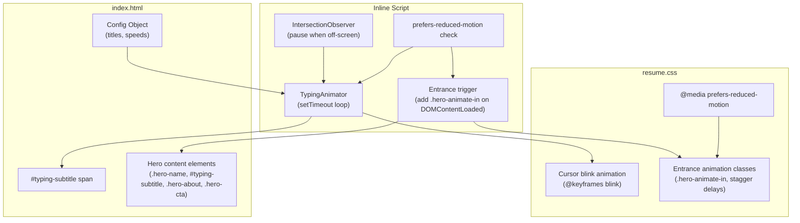

# Design Document: Website Improvements — Hero Typing Animation & Entrance Effects

## Overview

This design adds two visual enhancements to the hero section of a vanilla HTML/CSS/JS portfolio site:

1. A **typing animation** (Typing_Animator) that cycles through professional titles with a blinking cursor
2. **Staggered entrance animations** for hero content elements on page load

The site has no build system or framework — it's plain HTML with inline `<script>` tags, a single CSS file (`static/css/resume.css`), AOS.js for scroll animations, and CSS custom properties for theming. All new code will follow this pattern: CSS additions go into `resume.css`, and JS is added inline in `index.html`.

The typing animation replaces the current static gap between the hero name and the about box with a dynamic subtitle line. The entrance animations replace the existing AOS `data-aos="fade-up"` on `.hero-content` with custom CSS-driven staggered animations for finer control and GPU-accelerated performance.

## Architecture



The architecture is intentionally flat — no modules, no bundler, no classes. A single config object feeds a `setTimeout`-based loop that manipulates one DOM element's `textContent`. An `IntersectionObserver` pauses/resumes the loop when the hero scrolls out of view. Entrance animations are pure CSS triggered by adding a class via JS.

## Components and Interfaces

### 1. Configuration Object

A plain JS object defined at the top of the inline `<script>` block:

```js
const TYPING_CONFIG = {
  titles: [
    'Software Development Engineer',
    'Full-Stack Developer',
    'Cloud Architect'
  ],
  typingSpeed: 80,    // ms per character (typing)
  deletingSpeed: 40,  // ms per character (deleting)
  pauseDuration: 1500 // ms pause after fully typed
};
```

### 2. Typing Animator (JS)

A procedural `setTimeout` loop — not a class — with the following state:

| Variable | Type | Purpose |
|---|---|---|
| `currentTitleIndex` | `number` | Index into `TYPING_CONFIG.titles` |
| `currentCharIndex` | `number` | Current character position |
| `isDeleting` | `boolean` | Whether we're in the deleting phase |
| `isPaused` | `boolean` | Set by IntersectionObserver when hero is off-screen |
| `timerId` | `number \| null` | Return value of `setTimeout`, used for cleanup |

Functions:

- `typeStep()` — core loop. Appends or removes one character, updates `textContent` of the subtitle `<span>`, schedules next call via `setTimeout`. Toggles `typing` class on the cursor element to suppress blink during active typing/deleting.
- `startTyping()` — entry point, called on `DOMContentLoaded` after reduced-motion check.
- `pauseTyping()` / `resumeTyping()` — called by IntersectionObserver callback.

### 3. Subtitle HTML Element

A new element inserted between `.hero-name` and `.hero-about`:

```html
<p class="hero-subtitle" id="typing-subtitle" aria-label="Software Development Engineer" aria-live="off">
  <span class="typing-text"></span><span class="typing-cursor" aria-hidden="true"></span>
</p>
```

- `.typing-text` — receives `textContent` updates from the animator
- `.typing-cursor` — styled as a blinking vertical bar via CSS `@keyframes`
- `aria-label` provides the full first title for screen readers
- `aria-live="off"` prevents character-by-character announcements

### 4. Cursor CSS

```css
.typing-cursor {
  display: inline-block;
  width: 2px;
  height: 1.1em;
  background: var(--color-accent);
  margin-left: 2px;
  vertical-align: text-bottom;
  animation: blink 1s step-end infinite;
}

.typing-cursor.typing {
  animation: none;
  opacity: 1;
}

@keyframes blink {
  0%, 100% { opacity: 1; }
  50% { opacity: 0; }
}
```

When the animator is actively typing or deleting, it adds the `.typing` class to suppress the blink and keep the cursor solid.

### 5. Hero Entrance Animations (CSS + JS trigger)

CSS classes for staggered fade-up:

```css
.hero-animate-target {
  opacity: 0;
  transform: translateY(30px);
}

.hero-animate-target.hero-animate-in {
  opacity: 1;
  transform: translateY(0);
  transition: opacity 0.8s ease-out, transform 0.8s ease-out;
}
```

Each hero element gets a CSS `transition-delay` for staggering:

| Element | Delay |
|---|---|
| `.hero-name` | `0ms` |
| `#typing-subtitle` | `300ms` |
| `.hero-about` | `600ms` |
| `.hero-cta` | `900ms` |

On `DOMContentLoaded`, JS adds `.hero-animate-in` to all `.hero-animate-target` elements. The existing AOS `data-aos` attribute on `.hero-content` is removed since we're replacing it with custom entrance animations.

### 6. IntersectionObserver (Viewport Pause)

```js
const observer = new IntersectionObserver(([entry]) => {
  if (entry.isIntersecting) resumeTyping();
  else pauseTyping();
}, { threshold: 0 });
observer.observe(document.getElementById('about'));
```

Pauses the `setTimeout` loop when the hero section scrolls out of view to save CPU.

### 7. Reduced Motion Handling

```js
const prefersReducedMotion = window.matchMedia('(prefers-reduced-motion: reduce)').matches;
```

If `true`:
- Skip typing animation entirely; set `.typing-text` to the first title as static text, hide cursor
- Skip entrance animations; all `.hero-animate-target` elements get `.hero-animate-in` immediately with no transition

CSS fallback:
```css
@media (prefers-reduced-motion: reduce) {
  .hero-animate-target {
    opacity: 1;
    transform: none;
    transition: none;
  }
  .typing-cursor {
    animation: none;
  }
}
```

## Data Models

This feature has no persistent data. All state is ephemeral in-memory JS variables:

```
TypingState {
  currentTitleIndex: number  // 0..titles.length-1, wraps around
  currentCharIndex: number   // 0..currentTitle.length
  isDeleting: boolean        // false = typing, true = deleting
  isPaused: boolean          // true when hero is off-screen
  timerId: number | null     // active setTimeout ID
}
```

The configuration object (`TYPING_CONFIG`) is read-only after initialization. The `titles` array is never mutated. The only DOM mutations are:
- `textContent` of `.typing-text` (string slice of current title)
- `classList` toggling on `.typing-cursor` (`.typing` class)
- `classList` toggling on hero elements (`.hero-animate-in` class)


## Correctness Properties

*A property is a characteristic or behavior that should hold true across all valid executions of a system — essentially, a formal statement about what the system should do. Properties serve as the bridge between human-readable specifications and machine-verifiable correctness guarantees.*

### Property 1: Character-by-character typing correctness

*For any* title string from the Title_List, after the typing animator has executed N type steps (where 0 ≤ N ≤ title.length), the visible text should equal the first N characters of that title string.

**Validates: Requirements 1.1**

### Property 2: Pause state after typing completes

*For any* title string, when the typing animator has typed all characters (charIndex === title.length), the next state transition should set a pause delay equal to the configured Pause_Duration before switching `isDeleting` to true — the animator should not begin deleting immediately.

**Validates: Requirements 1.2**

### Property 3: Title index cycling with modular wrap

*For any* Title_List of length N (N > 1) and any current title index `i`, after the animator finishes deleting the title at index `i`, the next title index should be `(i + 1) % N`. This ensures both sequential advancement and wrap-around from the last title back to the first.

**Validates: Requirements 1.3, 1.4**

### Property 4: Cursor blink suppression during active phases

*For any* typing state where `isDeleting` is true or `currentCharIndex` is actively changing (typing phase), the cursor element should have the `.typing` CSS class applied, which suppresses the blink animation. When the animator is in the pause state (not actively typing or deleting), the `.typing` class should be absent.

**Validates: Requirements 3.4**

### Property 5: First title used for accessibility and reduced motion

*For any* Title_List with at least one entry, the `aria-label` attribute on the typing subtitle container should equal `titles[0]`. Additionally, when `prefers-reduced-motion` is enabled, the displayed text content should equal `titles[0]` with no animation occurring.

**Validates: Requirements 5.1, 5.3**

### Property 6: Pause when hero is off-screen

*For any* typing animator state, when the IntersectionObserver reports that the hero section is not intersecting the viewport, the animator should be paused (`isPaused === true`) with no active `setTimeout` timer. When the hero section re-enters the viewport, the animator should resume from its previous state.

**Validates: Requirements 6.3**

## Error Handling

This feature has a small surface area for errors since it's a purely client-side visual enhancement with no network calls or user input.

| Scenario | Handling |
|---|---|
| Empty `titles` array | Guard at initialization: if `titles.length === 0`, skip animation entirely, leave subtitle empty |
| Single title in array | Type the title once, then stop. Do not enter delete/cycle loop (per Requirement 2.5) |
| DOM element not found | Guard `getElementById` calls: if `#typing-subtitle` or `.typing-text` is null, skip animation silently — no console errors thrown to the user |
| IntersectionObserver not supported | Feature-detect `IntersectionObserver`. If unavailable (very old browsers), let the animation run continuously without viewport pausing |
| `prefers-reduced-motion` matchMedia not supported | Default to running the animation (graceful degradation). The CSS `@media (prefers-reduced-motion: reduce)` rule still applies as a fallback |

No errors are surfaced to the user. All failures are silent and result in either static text or no subtitle — the page remains fully functional.

## Testing Strategy

### Property-Based Tests

Use **fast-check** (JavaScript property-based testing library) with a minimum of 100 iterations per property.

Each property test should be tagged with a comment referencing the design property:

```
// Feature: website-improvements, Property 1: Character-by-character typing correctness
```

The typing animator logic should be extracted into pure functions that can be tested without a DOM:

- `getVisibleText(title, charIndex)` → returns `title.slice(0, charIndex)`
- `getNextState(currentState, config)` → returns the next `TypingState`
- `getNextTitleIndex(currentIndex, titlesLength)` → returns `(currentIndex + 1) % titlesLength`

These pure functions enable property-based testing without jsdom or browser dependencies.

Property tests to implement:

| Property | Generator Strategy | Assertion |
|---|---|---|
| P1: Char-by-char correctness | Generate random strings (1–200 chars), random charIndex (0..length) | `getVisibleText(title, n) === title.slice(0, n)` |
| P2: Pause after typing | Generate random titles, simulate state to end-of-type | Next state has `isDeleting=false` and delay equals `pauseDuration` |
| P3: Title index cycling | Generate random array lengths (2–50), random current index | `getNextTitleIndex(i, N) === (i + 1) % N` |
| P4: Cursor blink suppression | Generate random states (typing/deleting/paused) | `.typing` class present iff state is actively typing or deleting |
| P5: First title for a11y | Generate random string arrays (1–20 items) | `ariaLabel === titles[0]` and reduced-motion text === `titles[0]` |
| P6: Off-screen pause | Generate random typing states, simulate intersection=false | `isPaused === true` and `timerId === null` |

### Unit Tests

Use a standard test runner (e.g., the project can add a simple test setup with Vitest or plain Node test runner). Unit tests complement property tests for specific examples and edge cases:

- Default config values: `typingSpeed === 80`, `deletingSpeed === 40`, `pauseDuration === 1500`
- Single-title edge case: animator types once and stops
- Empty titles array: animator does nothing
- `aria-live="off"` attribute is set on the container
- Cursor element has `aria-hidden="true"`

### What Not to Test

- CSS animation timing (blink rate, transition durations) — these are visual and require manual/visual regression testing
- Responsive layout across viewports — use manual browser testing or visual snapshot tools
- GPU acceleration — verify via browser DevTools Layers panel, not automated tests
- JS payload size (< 1KB) — verify once during implementation, not in CI

